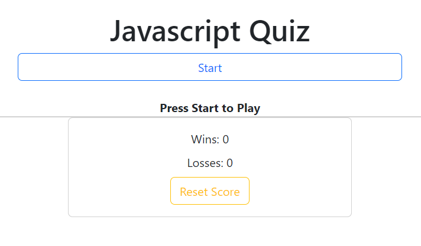

# JavaScript Quiz

## Description

This was created for a coding bootcamp - Challenge #4

The goal was to create a timed quiz from scratch using JavaScript and HTML.

## Installation

[Github Repo link.](https://github.com/flying-tadpole/JavascriptQuiz)

[Github Pages link.](https://flying-tadpole.github.io/JavascriptQuiz/)

Preview:

## Credits

Code snippets provided as a part of coding bootcamp.

[Bootstrap](https://getbootstrap.com/) used for styling.

Quiz questions from [here](https://www.javatpoint.com/javascript-mcq) and [here](https://www.w3schools.com/js/js_quiz.asp).
